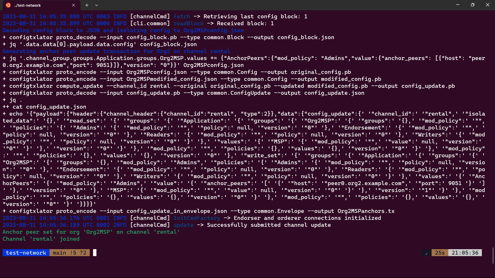
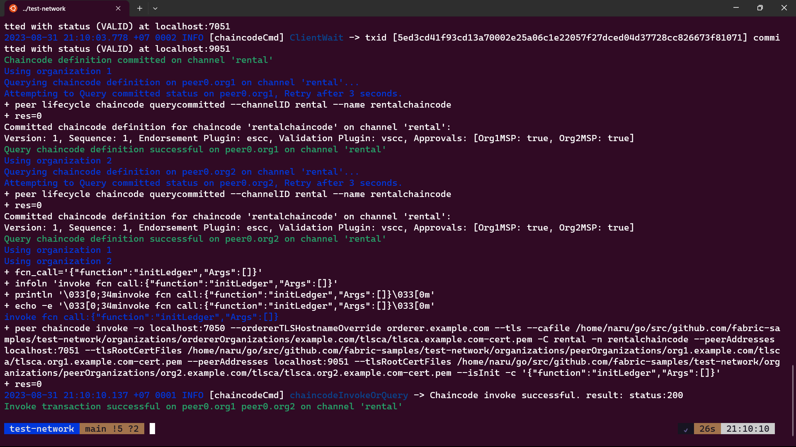

## Simple Hyperledger Fabric Blockchain Network for Car Rental Application

This repository contains a basic Hyperledger Fabric network and application built using JavaScript, focusing on a car rental use case that allows data reading and creation on the blockchain.

**Before You Begin:**
- Make sure you have successfully run the Hyperledger Fabric samples. If not, follow the guide: [Hyperledger Fabric Samples](https://github.com/hyperledger/fabric-samples/)

### Getting Started

#### Step 1: Clone or Download Repository
Clone or download this repository to your local machine.

#### Step 2: Move Repository Folder
Move the cloned/downloaded repository folder into the `fabric-samples` directory where you've set up the Fabric samples.

#### Step 3: Navigate to Test Network
In a terminal, go to the `test-network` directory under `fabric-samples`:

```sh
cd fabric-samples/test-network
```

#### Step 4: Set Up Network and Create Channel
Execute the following command to initiate the network and create a channel using the provided shell script:

```sh
./network.sh up createChannel -ca -c rental
```



#### Step 5: Deploy Chaincode
Deploy the chaincode to the network using this command:

```sh
./network.sh deployCC -ccn rentalchaincode -ccp ../asset-test-js/chaincode-js/ -ccv 1 -ccl javascript -cci initLedger -c rental
```



#### Step 6: Set Up Environment
Navigate to the `driverin-app` directory and create a `.env` file. Add the given environment variables:

```plaintext
CHAINCODE_NAME=rentalchaincode
CHANNEL_NAME=rental
ORG_USER_ID=driverinAppUser
PORT=8080
```

#### Step 7: Install Dependencies
In the `driverin-app` directory, install the necessary dependencies by running:

```sh
npm install
```

#### Step 8: Initialize Admin and User
To initialize admin and user identities, run this command (only once):

```sh
npm run init
```

#### Step 9: Start the Application
Begin the application by running:

```sh
npm start
```

### Note
This example serves as a foundational understanding of Hyperledger Fabric and its implementation. For further inquiries, please reach out to: rico@smartchaincode.com. CC for frontend to : nico@smartchaincode.com

---

**Note:** This guide provides a basic setup for a Hyperledger Fabric blockchain network and a car rental application. Advanced configurations and features can be incorporated to enhance the network and application's capabilities.